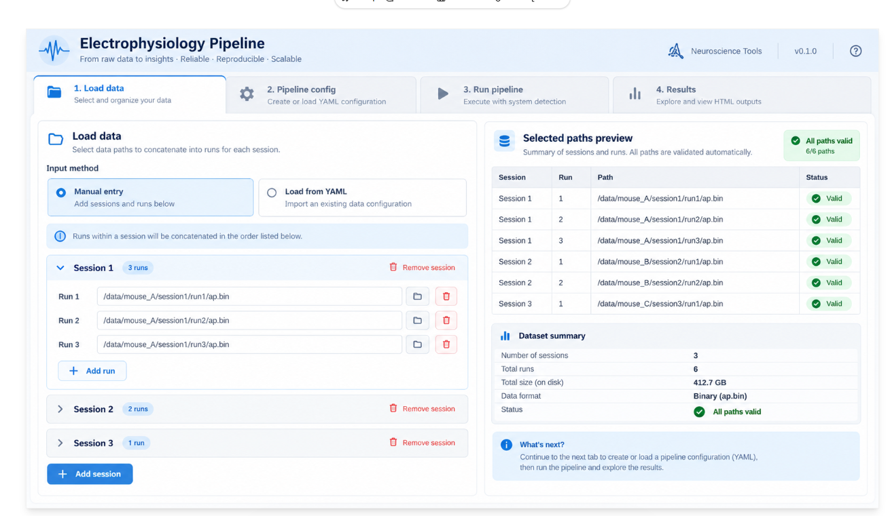

The main user-facing object will be the `Pipeline` class, allowing the user to run
the entire pipeline from start to finish.

It will estimate memory required and handle multi-processing. It can be
wrapped in a [SLURM runner](#memory-estimation-and-slurm) if required.

```python
from spikepipeline import Pipeline

pipeline = Pipeline(
  recordings="/path/to/recording",  # or Recording or list of either
  config="path/to/config.yaml",
  output_path="path/to/output/folder"
)

pipeline.run()

```

This produces an output directory with the structure described in [On-disk structure](on-disk-structure.qmd).


### Troubleshooting preprocessing

This is fairly straightforward, but the real world is more complex. Say we were setting up our pipeline, 
and wanted to check various parameters at each step.

Let's say our config does not include `artefact_detection`, so the pipeline goes
`raw_data_metrics_and_detect_bad_channels` -> `preprocessing`.

The iteration cycle is between running the pipeline,  inspecting outputs on disk, 
and making changes to the config file.

This is slightly different to the normal coding workflow (in which objects are returned in memory
and handled by the coder) however I think it is fairly intuitive and quick to get used to.

Let's say we start with:

```python
from spikepipeline import Pipeline, BadChannelDetectionStep

pipeline = Pipeline(
  recording=["path_to_recording1", "path_to_recording2"],
  config="path/to/config.yaml",
  output_path="path/to/output/folder",
  stop_before="preprocessing",
)
pipeline.run()
```

The recording input is a list of recordings one for each session, or dictionaryies where
the recording is split by shank e.g.

```
recording=[{"0": Recording1, "1": Recording2}, {"0": Recording3, "1": Recording4}]
```


This runs quality metrics and detect bad channels. We see from the detect-bad-channels
plots generated in the project folder that it has failed, and so adjust the parameters and run the step:

```python
pipeline = Pipeline(
  recording=["path_to_recording1", "path_to_recording2"],
  config="path/to/config.yaml",
  output_path="path/to/output/folder",
  start_at="detect_bad_channels",
  stop_before="preprocessing",
)
pipeline.run()
```

Let's say it looks much better now (the images and bad channel information 
are now on disk in the project folder).

We can pick up where we left off. We could continue to run the entire pipeline,
but maybe we want to prototype the preprocessing. We can run:

```python
pipeline = Pipeline(
  recording=["path_to_recording1", "path_to_recording2"],
  config="path/to/config.yaml",
  output_path="path/to/output/folder",
  start_at="preprocessing",
  stop_before="sorting",
  debug="1min",  # Slice a small part of the data and write results to a debug folder.
)
pipeline.run()

# We can support viewephys inspection

recordings_pp_chains = pipeline.preprocessing.get_preprocessed_recording_chains()

# [{"raw": recording, "filtered": recording, ...}, {"raw": recording, ...}]

# This will open two windows, one for each session's recording.
# It will be possible to view each preprocessing step through the GUI.
for pp_recordings in recordings_pp_chains:
  viewephys(pp_recordings)
```

We can adjust parameters and visually inspect, either with the images
stored on disk or interactively through viewephys.

Once we are happy with the results, and have our new settings encoded
in the config file, we can run the rest of the pipeline:

```python
pipeline = Pipeline(
recording=["path_to_recording1", "path_to_recording2"],
  config="path/to/config.yaml",
  output_path="path/to/output/folder",
  start_from="preprocessing",
)
```

## Pipeline steps

Individual pipeline steps can also be run piecemeal. Typically users
would not run these individual steps, but they allow developers to
arbitrarily wrap these as they wish (e.g. in docker images, as NextFlow nodes).

The steps will be:

1. `RawDataQualityMetricsStep()`
2. `DetectBadChannelsStep()`
3. `ArtifactDetectionStep()`
4. `ArtifactCurationStep()`
5. `PreprocessingStep()`
6. `SpikeSortingStep()`
7. `PostprocessingStep()`
8. `CurationStep()`

```python

from spikepipeline import RawDataQualityStep
import spikeinterface.full as si
recording = si.read_spikeglx("path/to/recording")

raw_data_step = RawDataQualityStep(
  recordings=recording,
  config="path/to/config.yaml",
  output_path="path/to/output/folder"
)
raw_data_step.run()

```

Later, you could run:

```python

from pipelime import PreprocessingStep
import spikeinterface.full as si

preprocessing_step = PreprocessingStep(
  recordings="path/to/recording",  # or an in-memory recording
  config="path/to/config.yaml",
  output_path="path/to/output/folder"
)
preprocessing_step.run()

```

which would detect the outputs of the previous step automatically. However, we might like to
make arguments to pass these manually e.g. `event_periods_path` and `bad_channel_ids_path`
if users request.

### Memory estimation and SLURM

Each step should be able to estimate its memory requirement. By default, it could use
the number maximal number of cores it can support based on available memory when `.run()` is called.
However, the number of cores for each step can be specified.

However, it should admit convenience functions to allow external machinery to manage memory:

```python

preprocessing_step = PreprocessingStep(
  session_recordings="path/to/recording",  # or an in-memory recording
  config="path/to/config.yaml",
  output_path="path/to/output/folder"
  num_cores=8, # | None to estimate say 80% of available memory
)

mem_required = preprocessing_step.mem_required()
needs_gpu = preprocessing_step.needs_gpu()

```

We could also include a SLURM function that can coordinate jobs
from Python using [`submitit`](https://github.com/facebookincubator/submitit).

The SLURM function should accept a step class, recordings, and parameters directly.
It should determine the available shanks and sessions and submit one job for each
required shank/session combination.

```python
from spikepipeline import PreprocessingStep
from spikepipeline.slurm import slurm

slurm(
  PreprocessingStep,
  recordings=["/path/to/recording", "/path/to/recording2"],
  parameters={
    "config": "path/to/config.yaml",
    "output_path": "path/to/output/folder"
  }
)

```

The SLURM function should be distinct from the Python step API. This allows a modular
architecture where a step can instead be called from its own Docker container or another
workflow system. Shank and session parameterisation should be handled by `slurm`, rather
than by callers having to create one step object per shank or session.

If we have multiple shanks and sessions, and are concatenating, we 
can parallelise over shanks (keeping all sessions for each shank together, to be concatenated).
We can also do smarter stuff e.g. parallelise all shanks until session alignment / concentation,
wait then combine. But in the first instance we don't need to go this deep.

For example, callers should not need to manually expand an experiment into separate jobs:

## Versioning and user environment

The environment should contain nearly everything the user will need. This will lead to a heavy one-time 
install but the user will not have to worry about dependencies. 

The release cycle is envisioned to be slow and versions pinned to specific SpikeInterface / sorter versions. 

## Web App

The pipeline will be runnable and outputs can be inspected through a web application built in [Panel](https://panel.holoviz.org/).

The first page will handle loading user data. The user can select paths for runs (to concatenate if required),
for each session. This can be manual or the user can pass a YAML? of paths to combine and run, because we will
need a way to batch over subjects.

The second page will handle pipeline configs. This can be loaded directly from YAML or the user can create their own YAML here.

The third page will handle running the pipeline. We can detect the OS (e.g. is SLURM available)?, figure out memory etc. 
and run the pipeline here, reporting progress. The question here is if we want to use snakemake for this, and how developed
this part will be.

The fourth page will render HTML outputs from the pipeline.

AI says it can look like this:

