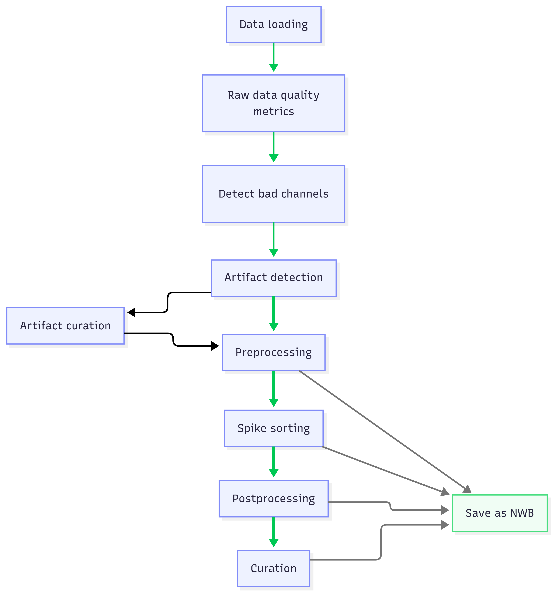

This document plans a high-level specification that defines the pipeline steps (and their inputs and outputs) to create a modern spike-sorting pipeline. The requirements of each step and proposed implementation are discussed. This documentation is not written for users but instead as guidelines for developers.

At a high level, the pipeline needs to be:

- **Modular**: the full pipeline can run from one command, but users can also run the pipeline up to any arbitrary step and stop for troubleshooting, parameter selection, and manual review.
- **Protective**: the implementation should check for common invalid or poor-practice choices and warn or fail before users create misleading outputs.

The [Allen AIND pipeline](https://github.com/AllenNeuralDynamics/aind-ephys-pipeline) already provides a detailed spike sorting pipeline run through Nextflow. This work aims to follow it as closely as possible, while extended it for raw data quality and artefact detection and curation, as well as implement in a Python API that can be run locally. 

The pipeline is designed for Python with steps run through [SpikeInterface](https://github.com/SpikeInterface/spikeinterface), with GUI-related review and curation handled in [viewephys](https://github.com/int-brain-lab/viewephys) for raw data and preprocessing, or [spikeinterface-gui](https://github.com/SpikeInterface/spikeinterface-gui) for sorting outputs.
Note that not all proposed functionality currently exists in these tools.

# Pipeline steps

The proposed pipeline steps are shown below:

1. [Data loading](data-loader.qmd)
2. [Raw data quality metrics](pipeline-steps.qmd#raw-data-quality-metrics)
3. [Artifact detection](pipeline-steps.qmd#artifact-detection)
4. [Artifact curation](pipeline-steps.qmd#artifact-curation)
5. [Preprocessing](pipeline-steps.qmd#preprocessing)
6. [Spike sorting](pipeline-steps.qmd#spike-sorting)
7. [Postprocessing](pipeline-steps.qmd#postprocessing)
8. [Curation](pipeline-steps.qmd#curation)

See [Pipeline steps](pipeline-steps.qmd) for full details on each step. The image below details how the steps interact, with thick green lines tracing the full automated pipeline, whereas thin lines trace additional possible data flows, including NWB conversion links from preprocessing, spike sorting, postprocessing, and curation.

