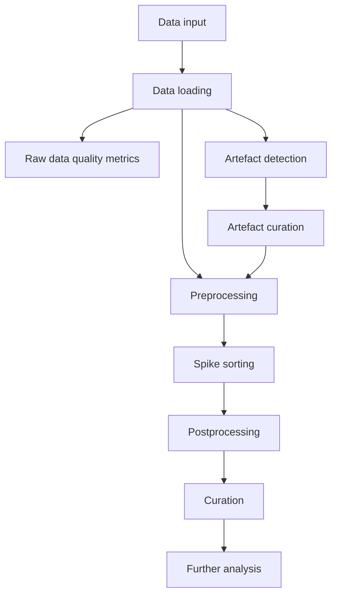

The pipeline operates on one or more recordings that represent a user-defined session. A session is a contiguous period of recording on which action potentials should be detected and sorted into units. Sessions may be processed independently, concatenated before sorting, or later matched across sessions.

The central design goal is to keep each stage inspectable and resumable. A user should be able to run the whole pipeline once the configuration is stable, but early workflows should support fast iteration on short time slices, preprocessing parameters, artefact curation, and sorter settings.

## Data flow

## Core inputs

| Input | Description | Notes |
|---|---|---|
| `DATA_INPUT` | User-provided paths, SpikeInterface recordings, or acquisition folders. | The pipeline expects recordings that can be interpreted as sessions. |
| `CONFIG_INPUT` | YAML configuration describing the selected steps and parameters. | The implementation should infer enabled steps from the config where possible. |
| `PROBE_INPUT` | Probe definition or path supplied by the user. | If the probe cannot be loaded automatically and is not supplied, the pipeline should stop early. |

## Core outputs

Each stage should write two kinds of output:

- A machine-readable stage result that can be passed to later steps.
- Human-readable reports, plots, and logs that support quality control.

Where possible, output folders should follow established SpikeInterface conventions and align with Allen-style ecephys processing concepts: preserve raw inputs, keep derived processing products separate, write explicit provenance, and make quality-control artefacts easy to inspect without loading the full dataset.

## Debug and iteration mode

Data loading should support a time slice or `--debug` mode so users can rapidly evaluate pipeline behaviour on a short segment before processing the full recording.
